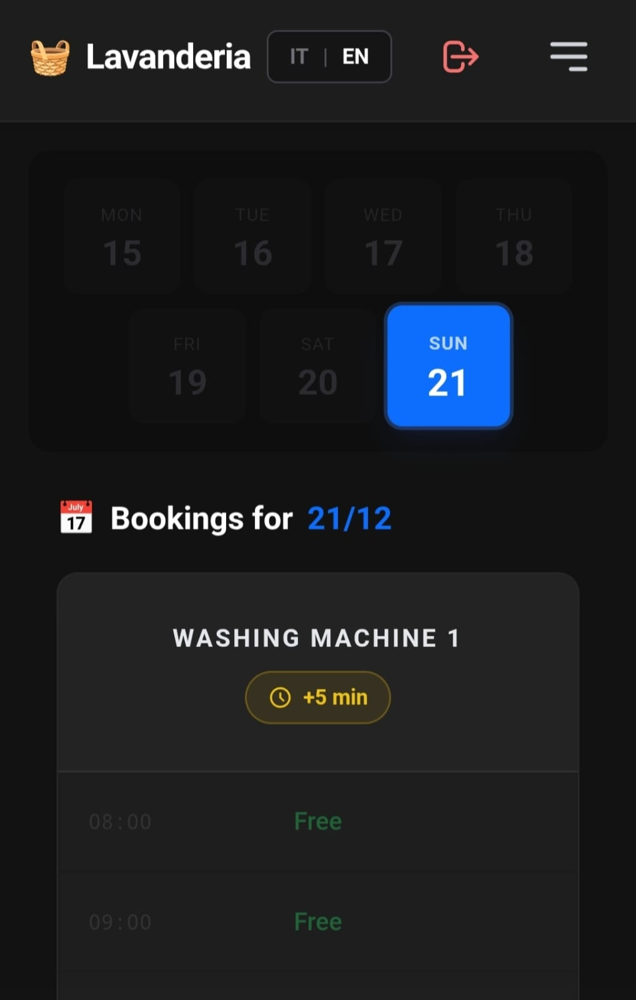
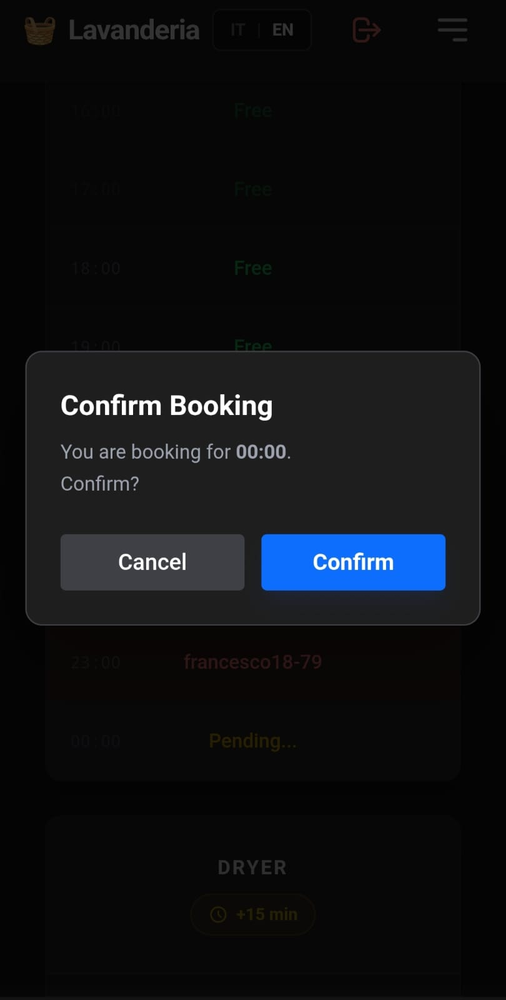
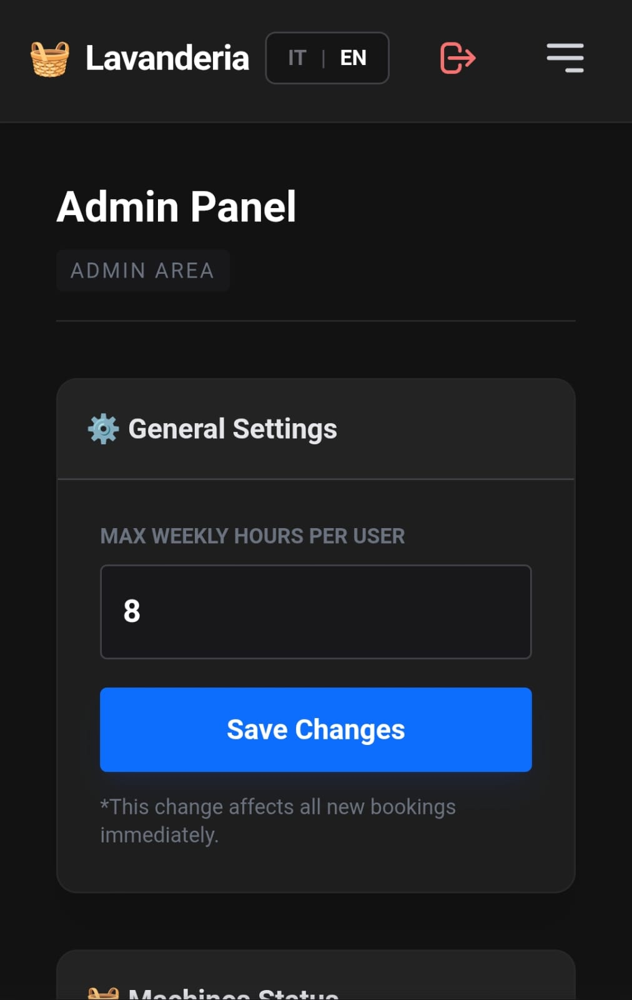

# 🧺 Lavanderia Galvani


> **Centralized booking system for washing machines and dryers at the Galvani student hall.**

A **Mobile-First** web application designed to resolve conflicts between tenants, prevent usage monopolies, and ensure fair access to common resources. Developed with a focus on **Privacy (GDPR)**, **Strict Validation**, and **Simplicity**.

---

## ✨ Key Features

### 🔒 Core & Security

- **Institutional Authentication**: Registration restricted to `@studio.unibo.it` or `@unibo.it` domains.
- **Privacy by Design**: Users are identified publicly only via randomized Usernames (e.g., `vincenzo12-89`).
- **Robust Security**: `PASSWORD_BCRYPT` hashing and strict server-side input validation to prevent manipulation.
- **GDPR Compliant**: Includes "Right to be forgotten" with irreversible data anonymization.

### 📅 Booking & Logic

- **Concurrency Control**: Pessimistic locking logic to prevent double-booking of the same slot.
- **Fair Usage Policy**: Dynamic weekly hour limits per user to prevent monopolies.
- **Smart Validation**:
  - Prevents booking in the past.
  - Restricts bookings to the current active week cycle.
  - Server-side date comparison (DateTime object oriented).

### 📱 UI/UX

- **Native Dark Mode**: Interface designed for low-light environments.
- **Mobile First**: "Thumb Zone" navigation optimization for smartphones.
- **Reactive Interface**: Instant feedback via toast notifications (Success/Error/Warning).
- **Multi-language**: Native support for Italian 🇮🇹 and English 🇬🇧.

### 🛠 Admin Panel

- **Asset Management**: Toggle machine status (Active/Maintenance) instantly.
- **User Oversight**: Reset passwords and anonymize problematic users.
- **Config Hot-Swap**: Adjust global booking limits without redeploying code.

---

## 📸 Screenshots

|   Device    |               Dashboard                |                Slot Booking                |               Admin Panel                |
| :---------: | :------------------------------------: | :----------------------------------------: | :--------------------------------------: |
| **Desktop** |        |        |        |
| **Mobile**  |  |  |  |

---

## 🏗 Tech Stack

Built to be lightweight, dependency-free, and deployable on any standard LAMP/LEMP stack.

- **Backend**: PHP 8.x (Vanilla, Strict Typing)
- **Database**: MySQL / MariaDB
- **Frontend**: HTML5, JavaScript (ES6+), Tailwind CSS (CDN)
- **Architecture**: Custom MVC-like routing (`index.php` entry point)

---

## 🚀 Local Installation

### Prerequisites

- PHP >= 8.0
- MySQL or MariaDB
- Web Server (Apache or Nginx)

### Steps

1.  **Clone the repository**

    ```bash
    git clone [https://github.com/vcardea/Lavanderia-Galvani.git](https://github.com/vcardea/Lavanderia-Galvani.git)
    cd Lavanderia-Galvani
    ```

2.  **Configure the Database**

    - Create a database named `lavanderia`.
    - Import the schema and initial data:

    ```bash
    mysql -u root -p lavanderia < database.sql
    ```

3.  **Configure Environment**

    - Open `src/config/database.php` and update credentials:

    ```php
    private $host = "localhost";
    private $db_name = "lavanderia";
    private $username = "root";
    private $password = "your_password";
    ```

    > **Note:** Ensure your PHP configuration (`php.ini`) has the correct timezone set to prevent booking logic errors:
    > `date.timezone = Europe/Rome`

4.  **Start the Server**

    If using the PHP built-in server:

    ```bash
    php -S localhost:8000
    ```

    Access via `http://localhost:8000`.

---

## 📂 Project Structure

```text
/
├── src/
│   ├── api/            # JSON Endpoints (Booking, Auth, Status)
│   ├── auth/           # Session & Authentication Logic
│   ├── config/         # Database & Global Constants
│   ├── lang/           # i18n Dictionaries (it.php, en.php)
│   ├── pages/          # View Controllers
│   ├── templates/      # Reusable Layout Components
│   ├── Lang.php        # Translation Helper
│   └── utils.php       # Sanitization & Formatting
├── public/
│   ├── css/            # Custom Overrides
│   ├── js/             # Client-side Logic (app.js)
│   └── img/            # Static Assets
├── database.sql        # Database Schema
├── index.php           # Main Router
└── README.md           # Documentation
```
