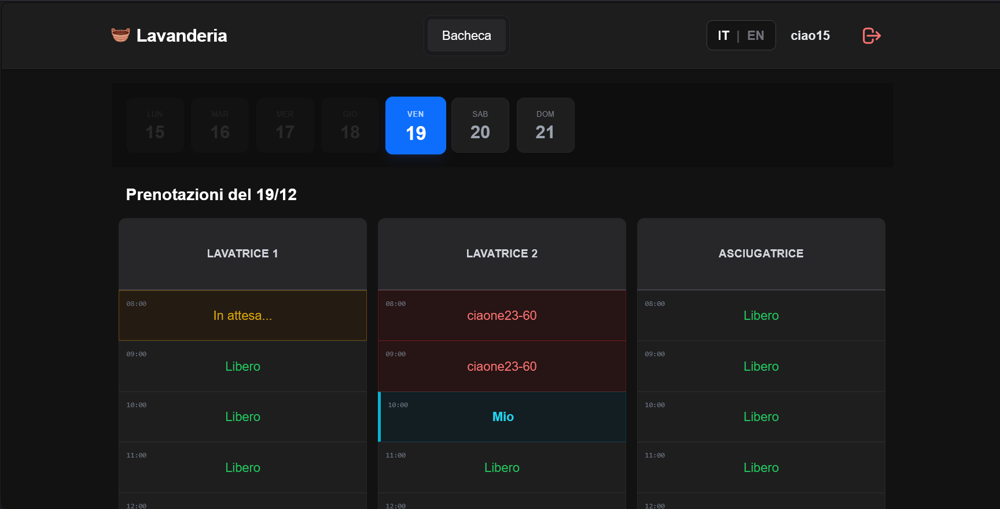
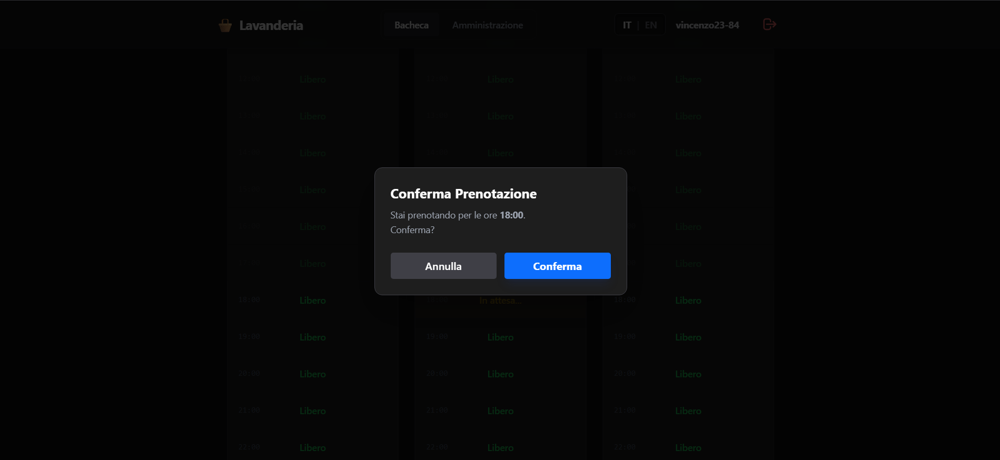
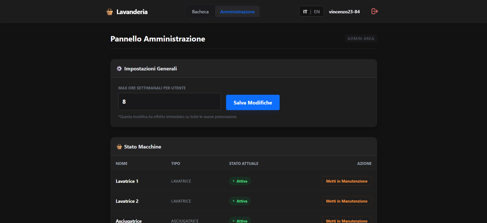
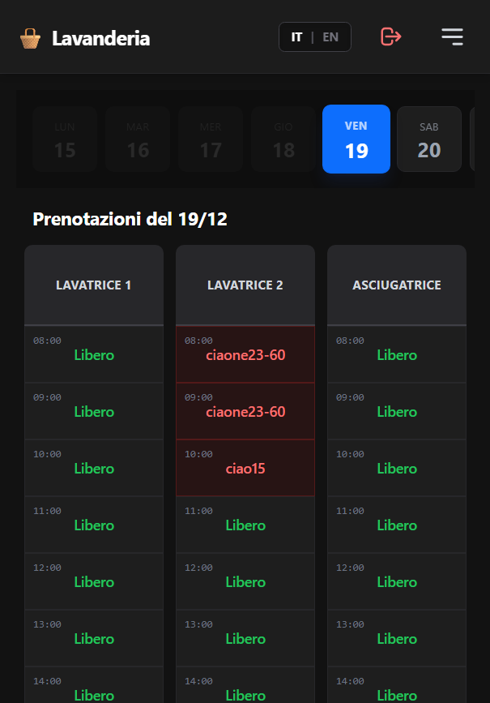
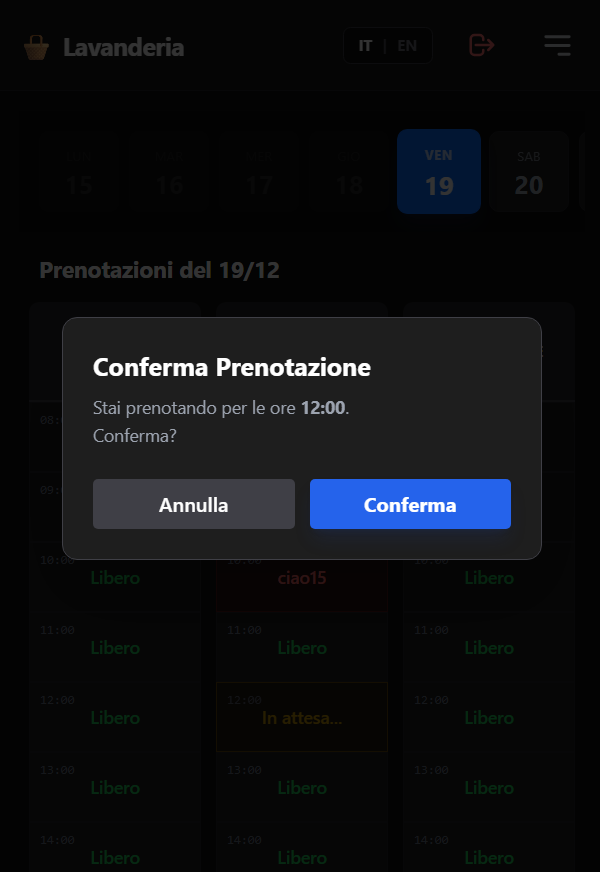
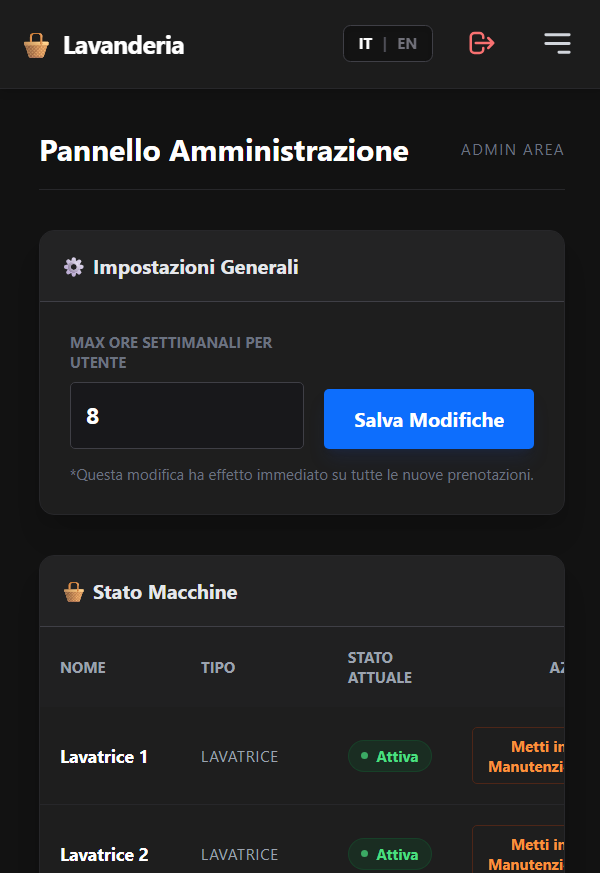

# 🧺 Lavanderia Galvani


> **Centralized booking system for washing machines and dryers at the Galvani student hall.**

A **Mobile-First** web application designed to resolve conflicts between tenants, prevent usage monopolies, and ensure fair access to common resources. Developed with a focus on **Privacy (GDPR)**, **Performance**, and **Simplicity**.

---

## ✨ Key Features

### 🔒 Core & Security

- **Institutional Authentication**: Registration allowed only via `@studio.unibo.it` or `@unibo.it` emails.
- **Privacy by Design**: Users are publicly identified via generated Usernames (e.g., `vincenzo12-89`) to protect real data.
- **Password Hashing**: Use of `PASSWORD_BCRYPT` for maximum security.
- **GDPR Compliant**: Right to be forgotten with an irreversible anonymization procedure.

### 📅 Booking & Logic

- **Pessimistic Locking**: Real-time anti-collision system. If two users click the same slot simultaneously, the database manages concurrency.
- **Weekly Limits**: Dynamic configuration to limit the number of bookable hours per week per user (Anti-Monopoly).
- **Time Slots**: Intelligent management of past and future slots (open only for the current week).

### 📱 UI/UX

- **Native Dark Mode**: Modern dark interface, easy on the eyes.
- **Mobile First**: Optimized for smartphone use ("Thumb Zone" navigation).
- **Immediate Feedback**: Modals and toast notifications for every action (confirmation, error, loading).
- **Multi-language**: Native support for Italian 🇮🇹 and English 🇬🇧.

### 🛠 Admin Panel

- **Machine Management**: Set washing machines to maintenance/active status with a single click.
- **User Management**: Password reset and anonymization of problematic users.
- **Global Configuration**: Modify booking limits in real-time without touching the code.

---

## 📸 Screenshots

|   Device    |               Dashboard                |                Slot Booking                |               Admin Panel                |
| :---------: | :------------------------------------: | :----------------------------------------: | :--------------------------------------: |
| **Desktop** |        |        |        |
| **Mobile**  |  |  |  |

---

## 🏗 Tech Stack

The project is built to be lightweight and easily deployable on any shared hosting or standard VPS.

- **Backend**: PHP 8.x (Vanilla, No Framework Bloat)
- **Database**: MySQL
- **Frontend**: HTML5, JavaScript (ES6+), Tailwind CSS (via CDN for rapid prototyping)
- **Architecture**: Custom MVC-like routing (`index.php` as entry point)

---

## 🚀 Local Installation

### Prerequisites

- PHP >= 8.0
- MySQL or MariaDB
- Web Server (Apache or Nginx)

### Steps

1.  **Clone the repository**

    ```bash
    git clone [https://github.com/vcardea/Lavanderia-Galvani.git](https://github.com/vcardea/Lavanderia-Galvani.git)
    cd Lavanderia-Galvani
    ```

2.  **Configure the Database**

    - Create an empty database (e.g., `lavanderia`).
    - Import the `database.sql` file (found in the root) to create tables and initial data.

    ```sql
    -- Example CLI import
    mysql -u root -p lavanderia < database.sql
    ```

3.  **Configure the connection**

    - Open `src/config/database.php`.
    - Modify the parameters with your local credentials:

    ```php
    private $host = "localhost";
    private $db_name = "lavanderia";
    private $username = "root";
    private $password = "";
    ```

4.  **Start the Server**
    - If using PHP built-in server (for rapid development):
    ```bash
    php -S localhost:8000
    ```
    - Visit `http://localhost:8000` in your browser.

---

## 📂 Project Structure

```text
/
├── src/
│   ├── api/            # AJAX Endpoints (JSON responses)
│   ├── auth/           # Login/Register/Logout logic
│   ├── config/         # DB Connection
│   ├── lang/           # Translation files (it.php, en.php)
│   ├── pages/          # Views (Dashboard, Admin, Privacy)
│   ├── templates/      # Header, Footer, partials
│   ├── Lang.php        # Language management class
│   └── utils.php       # Helper functions
├── public/
│   ├── css/            # Custom CSS (if needed beyond Tailwind)
│   └── js/             # Main App Logic (app.js)
├── database.sql        # DB Schema and Initial Data
├── index.php           # Main Router
└── README.md           # Documentation
```
